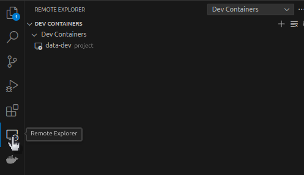

# Data Analyst Jobs in Canada

Goals: To better understand the Data Analyst job market in Canada to rationalize my attempts to land a Data Analyst role.

# Running the Code

## Prerequisites
Before you start make sure of the following:
- Need to be using a Unix Shell. 
    - For Windows use [git bash](https://git-scm.com/downloads). 
- [Docker](https://www.docker.com/) is installed and functional.
- Know the basics of Docker.

## Setting Up the Docker Container
If you want to run the code and notebooks in this project yourself follow the below steps.

1. Clone this repository: 
   `git clone https://github.com/0-Justin-ng/job-stats-analysis.git`  

2. Change permissions for `docker_build.sh` so it is executable by moving into the cloned directory and running the following command:
  `chmod +x ./docker_build.sh`  

3. Run `docker_build.sh` to build the image (`data-dev`) and run the container with this repository as an attached volume: 
  
`./docker_build.sh`
  

You should now have a working container that has all the requirements for running the code in this project. You can use any method you want to attach to the container. It is suggested to use VSCode with the `Docker` and `Dev Containers` extensions for ease-of-use. 

## Attaching to the Container
Here's an example of connecting to the container in VSCode after the container setup is complete. 

1. Click `Remote Explorer` on the side bar.

    

2. Right click the `data-dev` container > `Attach in New Window`. This will open a remote connection to the container which you can use as a development environment. You can use any functionality in VSCode as you normally would. 

Any changes you make to the mounted volume containing this project will also be reflected in the project directory on the host file system. 